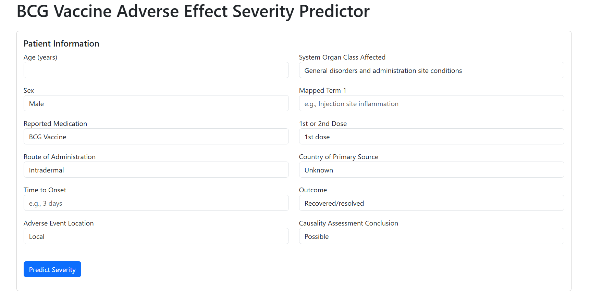
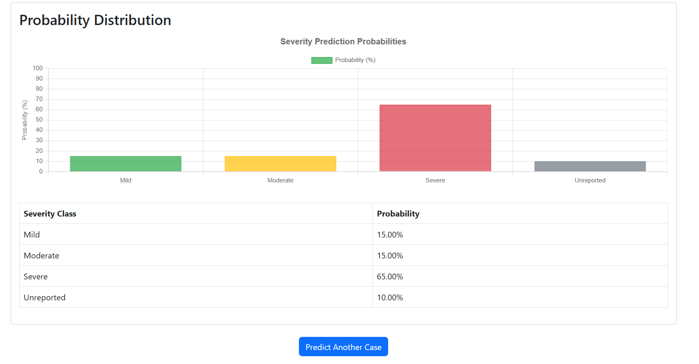

# BCG Severity Prediction Web App - Setup Guide

## 1. Files Structure

Make sure your project directory has the following structure:
```
bcg_severity_prediction/
├── app.py             # Flask application
├── prediction.py      # Prediction module
├── templates/         # HTML templates
│   ├── index.html     # Input form
│   ├── result.html    # Prediction results
│   └── error.html     # Error handling
└── models/            # Model files
    └── final_improved_bcg_severity_model.pkl  # Your trained model
```

## Application Screenshots

### Input Form



### Prediction Result



## 2. Installation Steps

1. Make sure you have Python 3.8+ installed
2. Install required packages:
   ```
   pip install flask pandas numpy scikit-learn lightgbm xgboost imbalanced-learn
   ```
3. Place your trained model file in the `models` directory
   - If you've already trained the model using the provided training script, it should be available as `final_improved_bcg_severity_model.pkl`
   - If not, you can use a simple rule-based fallback in the `prediction.py` file

## 3. Running the Application

1. Open a terminal/command prompt
2. Navigate to your project directory:
   ```
   cd path/to/bcg_severity_prediction
   ```
3. Run the Flask application:
   ```
   python app.py
   ```
4. Open your web browser and go to:
   ```
   http://127.0.0.1:5000
   ```

## 4. Troubleshooting

If you encounter any issues:

1. **Model file not found error**:
   - The prediction module has a built-in fallback that will provide rule-based predictions if the model file isn't found
   - Make sure your model file is in the correct location (`models/final_improved_bcg_severity_model.pkl`)

2. **Scikit-learn version compatibility issues**:
   - If you see errors related to "incompatible dtype" or similar, it means there's a version mismatch between the scikit-learn used to train the model and the version being used now
   - The prediction module has error handling that will fall back to rule-based predictions

3. **Missing required fields**:
   - The prediction module automatically handles missing fields by using default values

4. **Port already in use**:
   - Change the port in `app.py` by modifying the last line to:
     ```python
     app.run(debug=True, port=5001)
     ```
   - Then access the app at http://127.0.0.1:5001

## 5. Making Predictions

The web app should now provide different predictions based on the input data, with the following key fields having the most impact:

- Age/Years
- Adverse event by location (Local, Systemic, Mixed)
- Route of administration
- System Organ class affected
- Time to onset

Try entering different values to see how they affect the prediction.